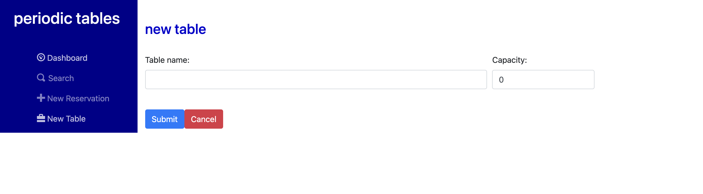

# PERIODIC TABLES
## SEAN GRANEY'S FINAL CAPSTONE FOR THINKFUL

## Links

GitHub Repo: https://github.com/SeanGraney29/take5-restaurant-reservation-main \
Heroku Deployment: https://graney-final-capstone.herokuapp.com/

## Overview
> A reservation system for restaurants.
> The software is used only by restaurant personnel when a customer calls to request a reservation.
> A restaurant manager can add, edit and search for reservations.
> Also see all the reservations listed for a specific date.
> One of the best features, is that you seat a reservation as a specific table and when they are done eating
        thier reservation status changes to finished.
> All past reservations are kept in the database, differetiated by their status.
> The customers do not access the system online.

Thank you for taking the time to look at this. I hope you enjoy it!

## API Documentation

| Route                     | API Verbs                                      | Description                                                      |
| --------------------------| -----------------------------------------------|----------------------------------------------------------------- |
| `/`                       |  GET and DELETE from "reservations" & "tables" | Pushes page to "/dashboard".                                     |
| `/dashboard`              |  GET and DELETE "reservations" & "tables"      | Displays the dashboard. The default is set to today's date.      | 
| `/dashboard?date=:date`   |  GET and DELETE"reservations" & "tables"       | Displays the reservations for the query date.                    |
| `/search`                 |  GET and DELETE "reservations"                 | A search form that lists reservation by mobile number.           |
| `/reservations`           |  GET and DELETE "reservations" & "tables"      | Pushes page to "/dashboard" for today's reservations.            |
| `/reservations/new`       |  POST to "reservations"                        | Displays the shared form for reservations with polite prompts.   |
| `/reservations/:id/edit`  |  PUT in "reservations"                         | Displays the shared form to edit reservation with id.            |
| `/tables/new`             |  PUT in "tables"                               | A form to add a new dining table to the restauraunt.             |

## Screenshots
Here are some of my favorite screenshots of the app.
_________________________________________________________________________________________________

dashboard.png^
_________________________________________________________________________________________________

empty-dashboard.png^
_________________________________________________________________________________________________

create-reservation.png^
_________________________________________________________________________________________________ 

create-reservation-with-party-error.png^
_________________________________________________________________________________________________

create-reservation-with-past-error.png^
_________________________________________________________________________________________________

create-reservation-with-range-error.png^
_________________________________________________________________________________________________

create-reservation-with-tuesday-error.png^
_________________________________________________________________________________________________

create-table-form.png^
_________________________________________________________________________________________________

create-table-with-capacity-error.png^
_________________________________________________________________________________________________

create-table-with-name-error.png^
_________________________________________________________________________________________________

reservation-search.png^ 
_________________________________________________________________________________________________

reservation-search-with-nothing-found.png^
_________________________________________________________________________________________________

reservation-search-with-results.png^                           
_________________________________________________________________________________________________

## Technologies Used

### Frontend
-React \
-Javascript \
-HTML \
-CSS \
-Bootstrap \
-React

### Backend
-Node.js \
-Express \
-Knex \
-PostgreSQL

## Installation

1. Fork and clone this repository.
1. Run `npm install` to install project dependencies.
1. Run `npm run start:dev` to start your server in development mode.

## Specific Details of App

### Create and list reservations

 `/reservations/new` 
   - has the following required and not-nullable fields:
     - First name: `<input name="first_name" />`
     - Last name: `<input name="last_name" />`
     - Mobile number: `<input name="mobile_number" />`
     - Date of reservation: `<input name="reservation_date" />`
     - Time of reservation: `<input name="reservation_time" />`
     - Number of people in the party, which must be at least 1 person. `<input name="people" />`
   - A `Submit` button that, when clicked, saves the new reservation, then displays the `/dashboard` page for the date of the new reservation
   - A `Cancel` button that, when clicked, returns the user to the previous page
   - Displays any error messages returned from the API

 `/dashboard`
   - All reservations for one date only. The date is defaulted to today, and the reservations are sorted by time.
   - Next, previous, and today buttons that allows the user to see reservations on other dates
   - Any error messages returned from the API

### Create reservation on a future, working date, within eligible timeframe

`/reservations/new`
    - Displays an error message with `className="alert alert-danger"` if any of the following constraints are violated:
    - The reservation date is a Tuesday as the restaurant is closed on Tuesdays.
    - The reservation date is in the past. Only future reservations are allowed.
    - The reservation time is before 10:30 AM.
    - The reservation time is after 9:30 PM, because the restaurant closes at 10:30 PM and the customer needs to have time to enjoy their meal.
    - The reservation date and time combination is in the past. Only future reservations are allowed.

### Seat reservation

`/tables/new`
   - Has the following required and not-nullable fields:
     -- Table name: `<input name="table_name" />`, which must be at least 2 characters long.
     -- Capacity: `<input name="capacity" />`, this is the number of people that can be seated at the table, which must be at least 1 person.
   - A`Submit` button that, when clicked, saves the new table then displays the `/dashboard` page
   - A `Cancel` button that, when clicked, returns the user to the previous page

`/dashboard`
   - Displays a list of all reservations in one area.
   - Each reservation in the list:
     - Displays a "Seat" button on each reservation.
   - Display a list of all tables, sorted by `table_name`, in another area of the dashboard
     - Each table displays "Free" or "Occupied" depending on whether a reservation is seated at the table.

`/reservations/:reservation_id/seat`
   - Has the following required and not-nullable fields:
     - Table number
   - Does not seat a reservation with more people than the capacity of the table
   - Displays a `Submit` button that, when clicked, assigns the table to the reservation then displays the `/dashboard` page
   - PUT to `/tables/:table_id/seat/` in order to save the table assignment. The body of the request must be `{ data: { reservation_id: x } }` where X is the reservation_id of the reservation being seated.
   - Displays a `Cancel` button that, when clicked, returns the user to the previous page

### Finish an occupied table

`/dashboard`
   - Displays a "Finish" button on each _occupied_ table.
   - Clicking the "Finish" button displays the following confirmation: "Is this table ready to seat new guests? This cannot be undone." If the user selects "Ok" the system will: - Send a `DELETE` request to `/tables/:table_id/seat` in order to remove the table assignment. The tests do not check the body returned by this request. - The server returns 400 if the table is not occupied. - Refresh the list of tables to show that the table is now available.
   - Clicking the "Cancel" makes no changes.

### Reservation Status

`/dashboard`
   - Displays the status of the reservation. The default status is "booked"
   - displays the Seat button only when the reservation status is "booked".
   - clicking the Seat button changes the status to "seated" and hides the Seat button.
   - clicking the Finish button associated with the table changes the reservation status to "finished" and removes the reservation from the dashboard.
   - Set the status, PUT to `/reservations/:reservation_id/status` with a body of `{data: { status: "<new-status>" } }` where `<new-status>` is one of booked, seated, or finished

### Search for a reservation by phone number

`/search`
   - Displays a search box `<input name="mobile_number" />` that displays the placeholder text: "Enter a customer's phone number"
   - Display a "Find" button next to the search box.
   - Clicking on the "Find" button submits a request to the server
     - then the system looks for the reservation(s) in the database and display all matched records on the `/search` page using the same reservations list component as the `/dashboard` page.
     - the search page displays all reservations matching the phone number, regardless of status.
   - Displays `No reservations found` if there are no records found after clicking the Find button.

### Change an existing reservation

`/dashboard` and `/search`
   - Display an "Edit" button next to each reservation
     - Clicking the "Edit" button will navigate the user to the `/reservations/:reservation_id/edit` page
   - Display a "Cancel" button next to each reservation
   - Clicking the "Cancel" button will display the following confirmation: "Do you want to cancel this reservation? This cannot be undone."
     - Clicking "Ok" on the confirmation dialog, sets the reservation status to `cancelled`, and the results on the page are refreshed.
       - Sets the status of the reservation to `cancelled`
     - Clicking "Cancel" on the confirmation dialog makes no changes.

`/reservations/:reservation_id/edit` 
   - Displays the reservation form with the existing reservation data filled in
   - Only reservations with a status of "booked" can be edited.
   - Clicking the "Submit" button saves the reservation, then displays the previous page.
   - Clicking "Cancel" makes no changes, then display the previous page.

## Thanks for reading! Bye-bye!
